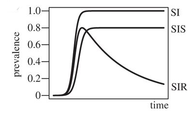
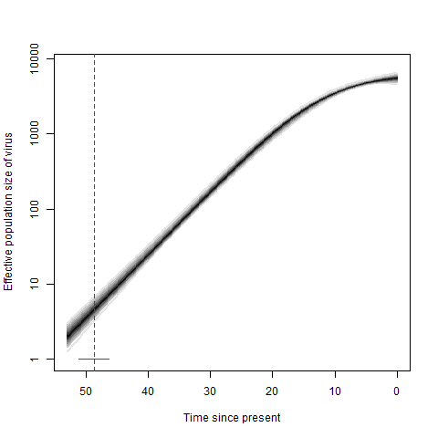
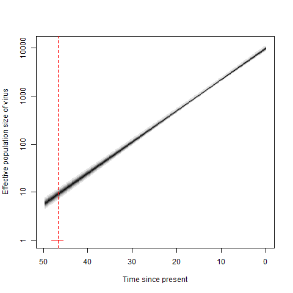

## Our team and contributions

- Metapopulation coalescent
    - Bethany Dearlove
- Providing phylogenies for Erik Volz's structured coalescent models
    - Mukarram Hossain

## Metapopulation coalescent

Dearlove and Wilson PTRSB (2013)

## SI/SIS/SIR dynamics

## Metapopulation coalescent: pros and cons

- Advantages
    - Explicitly linked to epidemiological models
    - SI/SIS/SIR comparison directly addresses decrease in incidence
    - Considers within-host variation
- Disadvantages
    - Slow, even with a fixed topology (RAxML based)

## Ne for Village A

## Ne for Village B

## Results for objectives

- % acute low
    - overestimated incidence reduction (2-fold)
    - close (within 1%) for % incidence
- % acute high
    - incidence reduction close
    - overestimation of % incidence (4-5 fold)

## Tree reconstruction for village datasets

- Phylogenetic reconstruction using BEAST and MrBayes suffered from poor mixing of the Markov chains
- We used the training dataset for village to identify the best *fast* method for a point estimate of the tree

## How to get a reliable topology?

- Robinson-Foulds distance (smaller is better)
    - TN93+NJ: 292
    - FastTree, GTR+CAT(20): 92
    - ExaML (-D option), GTR+CAT(25), gag/pol/env: 96
    - ExaML, GTR+CAT(25), gag/pol/env: 80
    - RAxML, GTR+G(4)+I, gag/pol/env: 102

## How to get reliable branch lengths?

- Used ExaML trees
    - Performed better than FastTree for regional
    - Faster than PhyML or RAxML
- Compared patristic distances using linear regression
    - Path-o-gen+chronos: slope 1.09, R2 = 85.0%
    - Least squares dating: slope 1.009, R2 = 98.3%

## Summary

- Despite the appeal of the metapopulation model, results were mixed
    - Assumption of a homogenous population?
    - SI/SIS models assume a population size of 8000
- Work in progress for tree reconstruction for regional analyses
